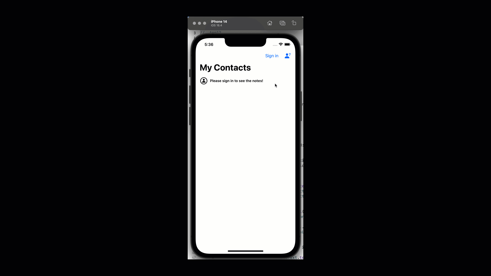

# 12.3.1. Building the Right Bar Button(s) for Sign In and Logout

We add two buttons on the right navigation bar, triggering the same action. We do it to display an image and text to explain to the user what to do. (This is not standard practice, you can design your own buttons.)

We will separate the logic of creating and handling the right bar button actions from the ViewController. So, let's create a new file `Main Screen -> RightBarButtonManager.swift` and write the following code there:



```swift
//
//  RightBarButtonManager.swift
//  App12
//
//  Created by Sakib Miazi on 6/2/23.
//

import UIKit
import FirebaseAuth

extension ViewController{
    func setupRightBarButton(isLoggedin: Bool){
        if isLoggedin{
            //MARK: user is logged in...
            let barIcon = UIBarButtonItem(
                image: UIImage(systemName: "rectangle.portrait.and.arrow.forward"),
                style: .plain,
                target: self,
                action: #selector(onLogOutBarButtonTapped)
            )
            let barText = UIBarButtonItem(
                title: "Logout",
                style: .plain,
                target: self,
                action: #selector(onLogOutBarButtonTapped)
            )
            
            navigationItem.rightBarButtonItems = [barIcon, barText]
            
        }else{
            //MARK: not logged in...
            let barIcon = UIBarButtonItem(
                image: UIImage(systemName: "person.fill.questionmark"),
                style: .plain,
                target: self,
                action: #selector(onSignInBarButtonTapped)
            )
            let barText = UIBarButtonItem(
                title: "Sign in",
                style: .plain,
                target: self,
                action: #selector(onSignInBarButtonTapped)
            )
            
            navigationItem.rightBarButtonItems = [barIcon, barText]
        }
    }
    
    @objc func onSignInBarButtonTapped(){
        
    }
    
    @objc func onLogOutBarButtonTapped(){
        
    }
    
}
```


## setupRightBarButton(isLoggedin: Bool)

In the above code:

* Depending on whether there is a signed-in user or not, we change the appearance and behavior of the right bar button. If the user is signed in, we display the logout button; else, we display the sign-in button.
* In both cases, we add two buttons to do the same tasks. If you look at lines 28 and 45, we add the pair of buttons together.
* For the logout buttons, the action would be `onLogOutBarButtonTapped()` method, and for the sign-in buttons, the action would be `onSignInBarButtonTapped()` method.

## onSignInBarButtonTapped()

When the sign-in bar button is tapped, we need to display an alert with the text fields to let the user sign in. It should have two buttons: 'SIgn In' and 'Logout.

So we will write the following logic inside the `onSignInBarButtonTapped()` method.


```swift
@objc func onSignInBarButtonTapped(){
    let signInAlert = UIAlertController(
        title: "Sign In / Register",
        message: "Please sign in to continue.",
        preferredStyle: .alert)
    
    //MARK: setting up email textField in the alert...
    signInAlert.addTextField{ textField in
        textField.placeholder = "Enter email"
        textField.contentMode = .center
        textField.keyboardType = .emailAddress
    }
    
    //MARK: setting up password textField in the alert...
    signInAlert.addTextField{ textField in
        textField.placeholder = "Enter password"
        textField.contentMode = .center
        textField.isSecureTextEntry = true
    }
    
    //MARK: Sign In Action...
    let signInAction = UIAlertAction(title: "Sign In", style: .default, handler: {(_) in
        if let email = signInAlert.textFields![0].text,
           let password = signInAlert.textFields![1].text{
            //MARK: sign-in logic for Firebase...
            
        }
    })
    
    //MARK: Register Action...
    let registerAction = UIAlertAction(title: "Register", style: .default, handler: {(_) in
        //MARK: logic to open the register screen...
        
    })
    
    //MARK: action buttons...
    signInAlert.addAction(signInAction)
    signInAlert.addAction(registerAction)
    
    self.present(signInAlert, animated: true, completion: {() in
        //MARK: hide the alerton tap outside...
        signInAlert.view.superview?.isUserInteractionEnabled = true
        signInAlert.view.superview?.addGestureRecognizer(
            UITapGestureRecognizer(target: self, action: #selector(self.onTapOutsideAlert))
        )
    })
}
@objc func onTapOutsideAlert(){
    self.dismiss(animated: true)
}
```


In the above code:

* On lines 2 through 5, we set up the title and message of the alert controller. Then on lines 7 through 19, we add two TextFields for email and password. The text fields are added to an array of text fields inside the alert controller.
* Then we define two actions for the alert controllers: "Sign In" (lines 22-28) and "Register" (lines 31-34). We need to write the logic for signing in and registering in these closures. We will write the logic momentarily.
* Then we will add the actions to the alert controller (lines 37-38).
* Then we present the alert controller (lines 40-46). In the completion closure, we write logic to handle if the user taps outside the alert. We need to dismiss the alert if the user taps outside. So, we add a Gesture Recognizer on the `superview` (the screen which popped this alert) of the alert controller. If the user taps on the super view, the alert gets dismissed.

<mark style="color:orange;">**We will keep the sign-in and register logic empty and return to that momentarily.**</mark>

## onLogOutBarButtonTapped()

Now, when the user taps on the logout right bar button, we need to confirm that the user really wants to log out. So we need to show another alert to confirm the log-out operation. Let's write the following code in `onLogOutBarButtonTapped()` method:

```swift
@objc func onLogOutBarButtonTapped(){
    let logoutAlert = UIAlertController(title: "Logging out!", message: "Are you sure want to log out?", 
        preferredStyle: .actionSheet)
    logoutAlert.addAction(UIAlertAction(title: "Yes, log out!", style: .default, handler: {(_) in
            do{
                try Auth.auth().signOut()
            }catch{
                print("Error occured!")
            }
        })
    )
    logoutAlert.addAction(UIAlertAction(title: "Cancel", style: .cancel))
    
    self.present(logoutAlert, animated: true)
}
```

### **In the above code, we use a different alert controller style, ".actionSheet". An action sheet pops up from the bottom edge.**

* If the user taps on the action 'Yes, Log out!' we call the Firebase authentication service to log the current user out.
* If the user wats to stay logged in, they can tap 'Cancel.'

## Patching ViewController to display the Right Bar Buttons

We still need to display the Right Bar buttons on the Main Screen. So open up the ViewController.swift file and update the `handleAuth` closures to manage the sign-in and logout bar buttons:

```swift
//
//  ViewController.swift
//  App12
//
//  Created by Sakib Miazi on 6/1/23.
//
//codes omitted....
override func viewWillAppear(_ animated: Bool) {
    super.viewWillAppear(animated)
    
    //MARK: handling if the Authentication state is changed (sign in, sign out, register)...
    handleAuth = Auth.auth().addStateDidChangeListener{ auth, user in
        if user == nil{
            //MARK: not signed in...
            
            //codes omitted...
            //MARK: Sign in bar button...
            self.setupRightBarButton(isLoggedin: false)
            
        }else{
            //MARK: the user is signed in...
            
            //codes omitted...
            //MARK: Logout bar button...
            self.setupRightBarButton(isLoggedin: true)
            
        }
    }
}
```

See in the above code:

* If the user is not signed-in, we set up the right bar button with the parameter `isLoggedin` as false.
* Conversely, if the user is signed-in, we set up the right bar button with the parameter `isLoggedin` as true.

Now run the app again!

<figure><figcaption></figcaption></figure>
