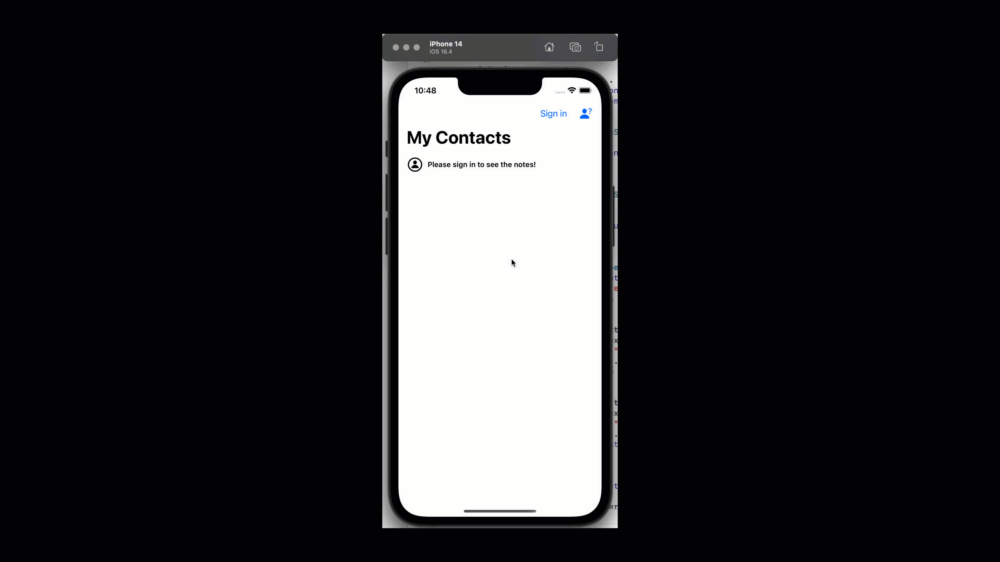

# 12.3.3. Implementing Sign In

Now it's time to sign in with an already created user.

We just need to add a few lines of code inside `RightBarButtonManager.swift` file inside the `signInAction` alert action:


```swift
//
//  RightBarButtonManager.swift
//  App12
//
//  Created by Sakib Miazi on 6/2/23.
//

import UIKit
import FirebaseAuth

extension ViewController{
    func setupRightBarButton(isLoggedin: Bool){
        //code omitted...
    }
    
    @objc func onSignInBarButtonTapped(){
        //codes omitted...
        
        //MARK: Sign In Action...
        let signInAction = UIAlertAction(title: "Sign In", style: .default, handler: {(_) in
            if let email = signInAlert.textFields![0].text,
               let password = signInAlert.textFields![1].text{
                //MARK: sign-in logic for Firebase...
                self.signInToFirebase(email: email, password: password)
            }
        })
        //codes omitted...
    }
    //codes omitted...
    func signInToFirebase(email: String, password: String){
        //MARK: can you display progress indicator here?
        //MARK: authenticating the user...
        Auth.auth().signIn(withEmail: email, password: password, completion: {(result, error) in
            if error == nil{
                //MARK: user authenticated...
                //MARK: can you hide the progress indicator here?
            }else{
                //MARK: alert that no user found or password wrong...
            }      
        })
    }
}


```


Here:

* We add line 24 to call a method to sign in to an existing account.
* On lines 30 through 41, we define the `signInToFirebase` method. If there is no error, then great! We will load the homepage with the signed-in user. Else, display an alert to notify the user that the email or password was wrong.

If we run the app now, you will see:

<figure><figcaption></figcaption></figure>

_<mark style="color:purple;">**Can you display a progress indicator while the login operation is happening?**</mark>_

## App12 code so far:


