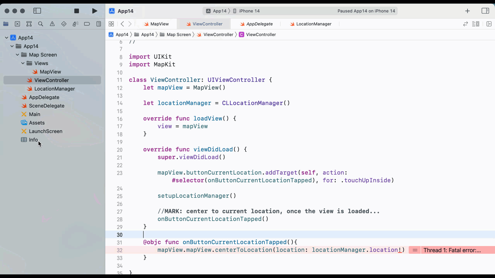

# 14.1. Phase 1: Displaying Map View and Current Location

## Setting up the Map View

Our landing screen will be a Map screen. In the first step, we will have a button to show the current location on the map.&#x20;

Let's create a file named MapView.swift.&#x20;

.png>)

Let's put the following code in the file:


```swift
//
//  MapView.swift
//  App14
//
//  Created by Sakib Miazi on 6/14/23.
//

import UIKit
import MapKit

class MapView: UIView {
    var mapView:MKMapView!
    var buttonLoading:UIButton!
    var buttonCurrentLocation:UIButton!
    
    override init(frame: CGRect) {
        super.init(frame: frame)
        backgroundColor = .white
        setupMapView()
        setupButtonLoading()
        setupButtonCurrentLocation()
        initConstraints()
    }
    
    func setupMapView(){
        mapView = MKMapView()
        mapView.translatesAutoresizingMaskIntoConstraints = false
        mapView.layer.cornerRadius = 10
        self.addSubview(mapView)
    }
    
    func setupButtonLoading(){
        buttonLoading = UIButton(type: .system)
        buttonLoading.setTitle(" Fetching Location...  ", for: .normal)
        buttonLoading.titleLabel?.font = UIFont.boldSystemFont(ofSize: 20)
        buttonLoading.setImage(UIImage(systemName: "circle.dotted"), for: .normal)
        buttonLoading.layer.backgroundColor = UIColor.black.cgColor
        buttonLoading.tintColor = .white
        buttonLoading.layer.cornerRadius = 10
        
        buttonLoading.layer.shadowOffset = .zero
        buttonLoading.layer.shadowRadius = 4
        buttonLoading.layer.shadowOpacity = 0.7
        
        buttonLoading.translatesAutoresizingMaskIntoConstraints = false
        
        buttonLoading.isEnabled = false
        self.addSubview(buttonLoading)
    }
    
    func setupButtonCurrentLocation(){
        buttonCurrentLocation = UIButton(type: .system)
        buttonCurrentLocation.setImage(UIImage(systemName: "location.circle"), for: .normal)
        buttonCurrentLocation.layer.backgroundColor = UIColor.lightGray.cgColor
        buttonCurrentLocation.tintColor = .blue
        buttonCurrentLocation.layer.cornerRadius = 10
        
        buttonCurrentLocation.layer.shadowOffset = .zero
        buttonCurrentLocation.layer.shadowRadius = 4
        buttonCurrentLocation.layer.shadowOpacity = 0.7
        
        buttonCurrentLocation.translatesAutoresizingMaskIntoConstraints = false
        
        self.addSubview(buttonCurrentLocation)
    }
    
    func initConstraints(){
        NSLayoutConstraint.activate([
            mapView.centerXAnchor.constraint(equalTo: self.safeAreaLayoutGuide.centerXAnchor),
            mapView.centerYAnchor.constraint(equalTo: self.safeAreaLayoutGuide.centerYAnchor),
            mapView.widthAnchor.constraint(equalTo: self.safeAreaLayoutGuide.widthAnchor, multiplier: 0.95),
            mapView.heightAnchor.constraint(equalTo: self.safeAreaLayoutGuide.heightAnchor, multiplier: 0.95),
            
            buttonLoading.centerXAnchor.constraint(equalTo: mapView.centerXAnchor),
            buttonLoading.centerYAnchor.constraint(equalTo: mapView.centerYAnchor),
            buttonLoading.widthAnchor.constraint(equalToConstant: 240),
            buttonLoading.heightAnchor.constraint(equalToConstant: 40),
            
            buttonCurrentLocation.trailingAnchor.constraint(equalTo: mapView.trailingAnchor, constant: -16),
            buttonCurrentLocation.bottomAnchor.constraint(equalTo: self.mapView.bottomAnchor, constant: -8),
            buttonCurrentLocation.heightAnchor.constraint(equalToConstant: 36),
            buttonCurrentLocation.widthAnchor.constraint(equalToConstant: 36)
        ])
    }
    
    required init?(coder: NSCoder) {
        fatalError("init(coder:) has not been implemented")
    }
}
```


In the above code:

* We import MapKit first.
* We have a MKMapView, and two UIButtons (`buttonLoading` and `buttonCurrentLocation`).
  * `buttonLoading` is just a dumb button to display the status when the location is getting fetched. You can use a Progress Activity Dialog instead of this.
* On lines 25 through 29, we initialize the map view.
  * On line 28, we set the corner radius of the map view.
* On lines 32 through 49, we define the `buttonLoading` button.
* On lines 51 through 65, we define the `buttonCurrentLocation` button.
* And finally, we initialize the constraints on lines 67 through 84.
  * Make sure you define the height and width of the map view using constraints.

## Patching the View with the Controller

Let's open the ViewController.swift file and put the following code there:

```swift
//
//  ViewController.swift
//  App14
//
//  Created by Sakib Miazi on 6/14/23.
//

import UIKit

class ViewController: UIViewController {
    let mapView = MapView()
    
    override func loadView() {
        view = mapView
    }

    override func viewDidLoad() {
        super.viewDidLoad()
        // Do any additional setup after loading the view.
    }

}

```

Let's run the app now.

<figure><figcaption></figcaption></figure>

## Location Manager

Now we will work on fetching the current location and moving the camera (map frame) to that location. Let's create a new file named LocationManager.swift. 

Let's add the following code to the file:


```swift
//
//  LocationManager.swift
//  App14
//
//  Created by Sakib Miazi on 6/14/23.
//

import Foundation
import CoreLocation

//MARK: setting up location manager delegate...
extension ViewController: CLLocationManagerDelegate{
    func setupLocationManager(){
        //MARK: setting up location manager to get the current location...
        locationManager.delegate = self
        locationManager.desiredAccuracy = kCLLocationAccuracyBest
        locationManager.requestWhenInUseAuthorization()
        locationManager.startUpdatingLocation()
    }
    
    func locationManagerDidChangeAuthorization(_ manager: CLLocationManager) {
        //MARK: if the user either allows location while using the app or always...
        if manager.authorizationStatus == .authorizedWhenInUse
            || manager.authorizationStatus == .authorizedAlways{
            manager.requestLocation()
        }
    }
    
    func locationManager(_ manager: CLLocationManager, didUpdateLocations locations: [CLLocation]) {
        if let location = locations.first{
            mapView.buttonLoading.isHidden = true
            
        }
    }
    func locationManager(_ manager: CLLocationManager, didFailWithError error: Error) {
        print("location error: \(error.localizedDescription)")
    }
}
```


In the above code:

* We import the CoreLocation library.
* We extend the ViewController with `CLLocationManagerDelegate` protocol.&#x20;
* On lines 13 through 19 we initialize the location manager.&#x20;
  * **(We need to define the `locationManager` constant in ViewController.swift file):**
    * `let locationManager = CLLocationManager()`.
  * On line 15, we delegate the location manager to the current controller (ViewController).
  * On line 16, we set up the accuracy of GPS location for this location manager. We select the best accuracy for this app. **Remember that the best accuracy setting is not great for your device's battery.** There are many other accuracy settings like kCLLocationAccuracyHundredMeters, kCLLocationAccuracyNearestTenMeters, kCLLocationAccuracyBestForNavigation, etc. For details: [https://www.flybuy.com/understanding-location-settings-for-your-ios-and-android-apps](https://www.flybuy.com/understanding-location-settings-for-your-ios-and-android-apps).
  * On line 17, we request permission from the user to access the current location. Here I am asking for the 'while using the app' permission.
  * On line 18, we ask the location manager to seek for current location periodically. If you do not need continuous periodic location updates, you can request location only once by calling `locationManager.requestLocation()`.&#x20;
* On lines 21 through 27, we write the code for the adopted protocol method `locationManagerDidChangeAuthorization()`.&#x20;
  * First, we check if the user has given permission to access the location. If yes, then we request the location once.
* On lines 29 through 34, we implement the adopted method when `didUpdateLocations` gets triggered. When the location manager gets updated location coordinates, this method is called.
  * Basically, the location manager returns a list of locations together, since the user can be moving. We take the first one from the array here.
  * On line 31, we hide the loading button or remove the progress indicator.
  * On lines 35 through 37, we handle the error accessing the location.

## Action when the Current Location button is tapped

We need to implement the logic when the `buttonCurrentLocation` is tapped by the user. So we write `mapView.mapView.centerToLocation(location: locationManager.location!)` inside the `@objc func onButtonCurrentLocationTapped()` method in ViewController.swift file.&#x20;

The code so far in ViewController.swift file is:


```swift
//
//  ViewController.swift
//  App14
//
//  Created by Sakib Miazi on 6/14/23.
//

import UIKit
import MapKit

class ViewController: UIViewController {
    let mapView = MapView()
    
    let locationManager = CLLocationManager()
    
    override func loadView() {
        view = mapView
    }

    override func viewDidLoad() {
        super.viewDidLoad()
        
        mapView.buttonCurrentLocation.addTarget(self, action: #selector(onButtonCurrentLocationTapped), for: .touchUpInside)
        
        setupLocationManager()
    }
    
    @objc func onButtonCurrentLocationTapped(){
        if let uwLocation = locationManager.location{
            mapView.mapView.centerToLocation(location: uwLocation)
        }
    }

}
```


On lines 29 through 31, we center the map view to the current location with a radius of 1000 meters.&#x20;

* Now, it should yell at you saying could not find method `centerToLocation()`. Because MKMapView does not have `centerToLocation()` method by default. We need to extend MKMapView to center the view.

## Extending MKMapView to center the view to the current location

Let's open ViewController.swift file and add the following extension to enable centering to the current location:


```swift
//
//  ViewController.swift
//  App14
//
//  Created by Sakib Miazi on 6/14/23.
//

import UIKit
import MapKit

class ViewController: UIViewController {
    let mapView = MapView()
    let locationManager = CLLocationManager()
    //codes omitted...
}

extension MKMapView{
    func centerToLocation(location: CLLocation, radius: CLLocationDistance = 1000){
        let coordinateRegion = MKCoordinateRegion(
            center: location.coordinate,
            latitudinalMeters: radius,
            longitudinalMeters: radius
        )
        setRegion(coordinateRegion, animated: true)
    }
}

```


In the above code,

* On lines 19 through 23, we define a map region, where we define the center point of the map view to the current location. And then, we set the latitudinal and longitudinal span around the center.&#x20;

When the app loads, it still loads the entire North America. So, we need to zoom to the current location. So in ViewController.swift, after `setupLocationManager()` method we will call the `onButtonCurrentLocationTapped` method once to center the view:

```swift
    override func viewDidLoad() {
        super.viewDidLoad()
        
        mapView.buttonCurrentLocation.addTarget(self, action: #selector(onButtonCurrentLocationTapped), for: .touchUpInside)
        
        setupLocationManager()
        
        //MARK: center the map view to current location when the app loads...
        onButtonCurrentLocationTapped()
    }
    
    @objc func onButtonCurrentLocationTapped(){
        mapView.mapView.centerToLocation(location: locationManager.location!)
    }
```

## Setting up Info.plist to allow the location access

<figure><figcaption></figcaption></figure>

* Let's open Info.plist of the project.&#x20;
* Add a new row
  * The key should be: "NSLocationWhenInUseUsageDescription"
  * The value should be your explanation of why you would need this access. My explanation was: "This app requires location access to provide all the utilities.**"**

The emulator location is often set up as 'none' by default. In that case, it will not take you to a particular location. You can emulate the location of the emulator.&#x20;

### Setting the Simulator/Emulator location

* When the simulator is running, click on the Simulator Menu -> Features - > Location. You will see this:

<figure><figcaption></figcaption></figure>

* You can select 'Custom Location...' option to put your preferred coordinate to simulate the current location.

Let's run the app now.

<figure><figcaption></figcaption></figure>


## Code so far


