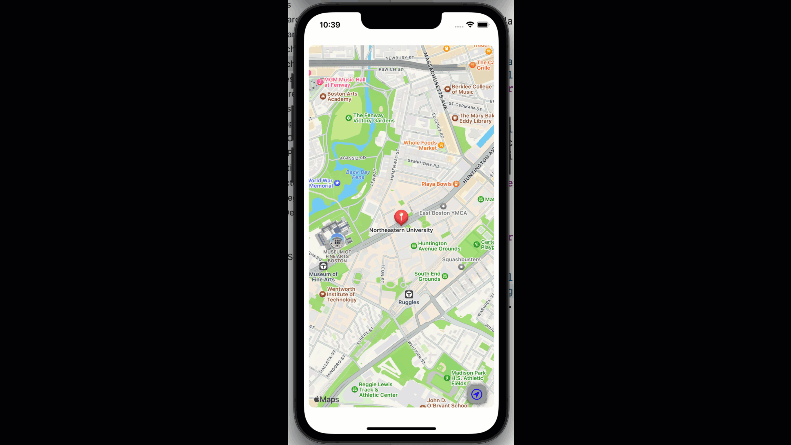

# 14.2. Phase 2: Annotations and Accessories for a certain place

In this module, we will learn how to annotate a place in a particular coordinate on the map view. For example, we can annotate Northeastern University on the map view like the following:

<figure><figcaption></figcaption></figure>

## Defining a Place class with MKAnnotation

We will define a class named Place, adopting the MKAnnotation protocol to annotate places on the map view. So let's create a new file named 'Place.swift' and put the following code there:


```swift
//
//  Place.swift
//  App14
//
//  Created by Sakib Miazi on 6/14/23.
//

import MapKit
import UIKit

class Place: NSObject, MKAnnotation {
    var title: String?
    var coordinate: CLLocationCoordinate2D
    var info: String

    init(title: String, coordinate: CLLocationCoordinate2D, info: String) {
        self.title = title
        self.coordinate = coordinate
        self.info = info
    }
    
    var mapItem: MKMapItem?{
        guard let location = title else{
            return nil
        }
        
        let placemark = MKPlacemark(
            coordinate: coordinate,
            addressDictionary:  [:]
        )
        let mapItem = MKMapItem(placemark: placemark)
        mapItem.name = title
        
        return mapItem
    }
}
```


In the above code:

* The class Place extends another Swift class NSObject, and adopts MKAnnotation protocol. MKAnnotation is a protocol that allows a Swift object to adopt MapKit's annotation-specific data and use the object directly as a place on the map.&#x20;
* On lines 12 through 14, we keep three variables to use in the annotation for a place.
  * title - the name of the place.
  * coordinate - the lat and long coordinates of the place.
  * info - additional details you may want to store.
  * You can use as many variables as you want to store more data regarding a place.
* Our initializer for the class Place is defined on lines through 16 through 20.
* Then we also initialize a variable `mapItem` of the type MKMapItem, to interact with the place on the map. MKMapItem class contains the details of a map location, like a placemark, coordinate, name, etc.
  * The placemark in a map item is the details of the place the map item represents, like the coordinate, physical address, phone number, images, etc. For now, we keep an empty dictionary for the addressDictionary of the placemark.
* Between lines 23 and 25, we used **guard-let** instead of if-let.

### What is guard-let?

**guard-let** is very similar to if-let to unwrap an optional value. `guard-let` is often used when you do not need to deal with the unwrapped value immediately and would use it later. So, we get the unwrapped value and store it in a constant for later use. For more, visit: [https://www.hackingwithswift.com/quick-start/understanding-swift/when-to-use-guard-let-rather-than-if-let](https://www.hackingwithswift.com/quick-start/understanding-swift/when-to-use-guard-let-rather-than-if-let)

## Display an Annotated Place on Map

Let's open the ViewController.swift file, and put the following code there:


```swift
//
//  ViewController.swift
//  App14
//
//  Created by Sakib Miazi on 6/14/23.
//

import UIKit
import MapKit

class ViewController: UIViewController {
    //codes omitted...
    override func viewDidLoad() {
        super.viewDidLoad()
        
        //codes omitted...
        
        //MARK: Annotating Northeastern University...
        let northeastern = Place(
            title: "Northeastern University",
            coordinate: CLLocationCoordinate2D(latitude: 42.339918, longitude: -71.089797),
            info: "LVX VERITAS VIRTVS"
        )
        
        mapView.mapView.addAnnotation(northeastern)
        
    }
    
    //codes omitted...
}
//codes omitted...
```


In the above code:

* On lines 19 through 23, we create a Place object, `northeastern` with the details of Northeastern University (title, coordinate, and info).&#x20;
* Then we add the Place `northeastern` as an annotation on the map on line 25.

Let's run the app.&#x20;

<figure><figcaption></figcaption></figure>

You can see there is a red bubble on the place `northeastern`. That is the placemark we talked about thus far.

## Interacting with the Annotations

Now to be able to interact with the bubble, we need to adopt a protocol `MKMapViewDelegate`. We  need to implement two adopted `mapView()` methods with parameters `viewFor` and `calloutAccessoryControlTapped`.&#x20;

Let's create a new file MapAnnotationDelegate.swift and put the following code there:


```swift
//
//  MapAnnotationDelegate.swift
//  App14
//  Repurposed from: https://www.hackingwithswift.com/read/16/3/annotations-and-accessory-views-mkpinannotationview
//  Created by Sakib Miazi on 6/14/23.
//

import Foundation
import MapKit

extension ViewController: MKMapViewDelegate{
    func mapView(_ mapView: MKMapView, viewFor annotation: MKAnnotation) 
        -> MKAnnotationView? {
        
    }
    
    func mapView(_ mapView: MKMapView, annotationView view: MKAnnotationView, 
        calloutAccessoryControlTapped control: UIControl) {
       
    }
}

```


In the above code:

* Between lines 12 through 15, we need to create an annotation view to display the placemark details. We can
* Between lines 17 through 20, we need to write the logic to handle in case the user taps on the accessory button of the annotation.

### Creating Annotation View

Let's put the following code in the `mapView()` method for `viewFor` (first method in the above code):


```swift
func mapView(_ mapView: MKMapView, viewFor annotation: MKAnnotation)
    -> MKAnnotationView? {
    guard let annotation = annotation as? Place else { return nil }
    
    var view:MKMarkerAnnotationView
    
    if let annotationView = mapView.dequeueReusableAnnotationView(
        withIdentifier: Configs.placeIdentifier) as? MKMarkerAnnotationView{
        
        annotationView.annotation = annotation
        view = annotationView
    
    }else{
        view = MKMarkerAnnotationView(annotation: annotation, reuseIdentifier: Configs.placeIdentifier)
        view.canShowCallout = true
        view.calloutOffset = CGPoint(x: -5, y: 5)
        view.rightCalloutAccessoryView = UIButton(type: .detailDisclosure)
    }
    return view
}
```


In the above code:

* On line 3, we define a new annotation from the `annotation` parameter as a Place object.
* Between line 7 and 18 we check if there is a reusable annotation already populated on screen,&#x20;
  * If yes, then we reuse the current annotation view.
  * Else, we create a new annotation&#x20;
    * We set the annotation view's `canShowCallout` parameter as true. It means it can display a callout interactive annotation view on this place.
    * Then we add a right accessory button on the callout annotation view.

### Delegating the User Interaction on the Callout

Let's put the following code in the `mapView()` method for `calloutAccessoryControlTapped` (second method):


```swift
func mapView(_ mapView: MKMapView, 
    annotationView view: MKAnnotationView, 
    calloutAccessoryControlTapped control: UIControl) {
        
    guard let annotation = view.annotation as? Place else { return }
    
    let ac = UIAlertController(
        title: annotation.title,
        message: "Navigate to \(annotation.title!) now?",
        preferredStyle: .alert
    )
    
    ac.addAction(UIAlertAction(title: "Navigate", style: .default, handler: {_ in
        let launchOptions = [
            MKLaunchOptionsDirectionsModeKey: MKLaunchOptionsDirectionsModeDriving
        ]
        annotation.mapItem?.openInMaps(launchOptions: launchOptions)
    }))
    
    ac.addAction(UIAlertAction(title: "Cancel", style: .cancel))
    present(ac, animated: true)
}
```


In the above code:

* The method gets triggered when the user taps the accessory callout right button.&#x20;
* It displays an alert controller with two actions (lines 7 through 21):
  * &#x20;On lines 13 through 18, we add the navigation action to the alert controller with a button named 'Navigation.'&#x20;
    * On lines 14 through 16, we define the launchOptions for opening navigation in Apple Maps. We set the navigation direction type as driving directions on line 15.
    * And on line 17, we open Apple Maps to navigate to the place annotated.
  * On line 20, we add a Cancel action for the alert controller.
  * Then finally, on line 21, we present the alert controller.&#x20;

We have a final task to do. We need to patch the delegate of the mapView to ViewController. Let's open ViewController.swift file and add the following line in `viewDidLoad()` method: `mapView.mapView.delegate = self`.&#x20;

Let's run the app.&#x20;

<figure><figcaption></figcaption></figure>

We first load the screen and display the annotation for Northeastern. Then we change the current simulator location to Apple's headquarters location.  Then we try the navigation with annotation. It opens the Apple Map, and we can drive!

## Code so far


