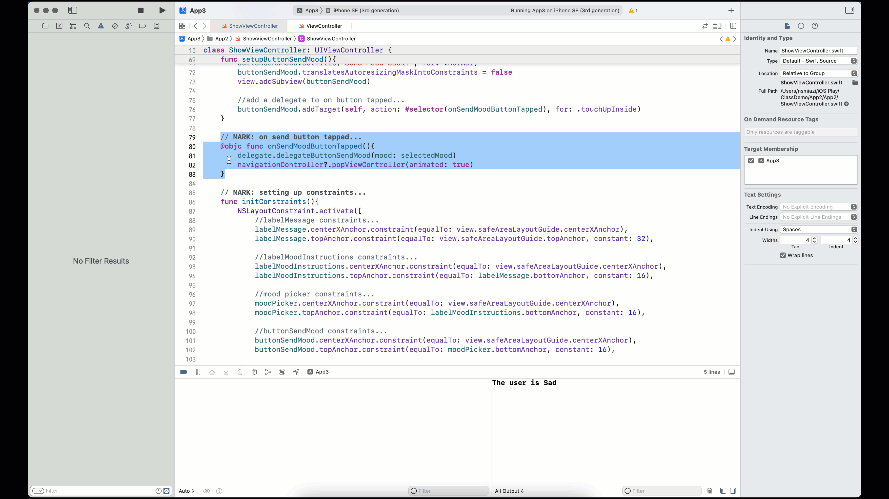

# 3.5. Send data back from Screen 2 to Screen 1, Part 3: delegating to ViewController

Now, let's enable the action for `buttonSendMood` in ShowViewController.swift file. So let's update `setupButtonSendMood()` and add a new selector method `onSendButtonTapped()`:

```swift
// setting up buttonSendMood...
func setupButtonSendMood(){
    buttonSendMood = UIButton(type: .system)
    buttonSendMood.setTitle("Send Mood back!", for: .normal)
    buttonSendMood.translatesAutoresizingMaskIntoConstraints = false
    view.addSubview(buttonSendMood)
    
    //add a delegate to on button tapped...
    buttonSendMood.addTarget(self, action: #selector(onSendButtonTapped), for: .touchUpInside)
}

// MARK: on send button tapped...
@objc func onSendMoodButtonTapped(){
    
}
```

### Declaring the delegate variable in ShowViewController.swift

**Before we write something in `onSendMoodButtonTapped()`,** we need to do a few more things. First, if we want to send the mood back to the first screen (ViewController), we need to ask the ViewController to receive the data and do the tasks afterward. We are delegating the tasks to VIewController after we click on `buttonSendMood`. So, we create a variable `delegate` in ShowViewController.swift file that can hold the reference to the instance of ViewController:

```swift
//
//  ShowViewController.swift
//  App3
//

class ShowViewController: UIViewController {

    var messageFromFirstScreen:String? = "No message received!" //First screen can set this variable...
    var delegate: ViewController! //delegate to ViewController...
    
    // codes omitted...
}
```

### Initializing delegate to the instance of ViewController (self)

**Now, let's go back to ViewController class** and ensure we set the `delegate`variable's value before pushing ShowViewController into the NavigationController. By doing that, we are ensuring that the instance of ShowViewController can have access to the instance of ViewController. So let's update the `@objc func onButtonSendTapped()` in ViewController:

```swift
//
//  ViewController.swift
//  App3
//

class ViewController: UIViewController {
    // codes omitted...
    // MARK: On button tapped delegate...
    @objc func onButtonSendTapped(){
        //initializing a new screen with ShowViewController...
        var showViewController = ShowViewController()
        
        //set the message to ShowViewController's messageFromFirstScreen variable...
        if let unwrappedMessage = textFieldMessage.text{
            if !unwrappedMessage.isEmpty{ // checking if the user has put any message...
                //Sending data...
                showViewController.messageFromFirstScreen = unwrappedMessage
            }
            //setting the delegate for receiving data...
            showViewController.delegate = self
        }
        
        //push the screen to Stack...
        navigationController?.pushViewController(showViewController, animated: true)
    }
    
    //codes omitted...

}
 
```

### Doing delegated tasks in ViewController

**Now, we need to add a method in ViewController** to conduct the delegated tasks from ShowViewController:

```swift
//
//  ViewController.swift
//  App3
//

class ViewController: UIViewController {
    // codes omitted...
    // MARK: On button tapped delegate...
    @objc func onButtonSendTapped(){
        //initializing a new screen with ShowViewController...
        var showViewController = ShowViewController()
        
        //set the message to ShowViewController's messageFromFirstScreen variable...
        if let unwrappedMessage = textFieldMessage.text{
            if !unwrappedMessage.isEmpty{ // checking if the user has put any message...
                //Sending data...
                showViewController.messageFromFirstScreen = unwrappedMessage
            }
            //setting the delegate for receiving data...
            showViewController.delegate = self
        }
        
        //push the screen to Stack...
        navigationController?.pushViewController(showViewController, animated: true)
    }
    
    //codes omitted...
    
    //MARK: delegated method from ShowViewController...
    func delegateButtonSendMood(mood: String){
        print("The user is \(mood)")
    }
    
    //codes omitted...
}
 
```

Here, `delegateButtonSendMood(mood:String)` receives a String (mood) as a parameter. Let's just print the mood for now.

Now, let's switch back to ShowViewController. **We now need to call this `delegateButtonSendMood(mood:String)` method when the user taps on `onSendMoodButton`.** We can write:

```swift
//
//  ShowViewController.swift
//  App3
//

class ShowViewController: UIViewController {
    // codes omitted in between...
    
    var delegate: ViewController! //delegate to ViewController...
    
    //codes omitted in between...
    // MARK: on send button tapped...
    @objc func onSendMoodButtonTapped(){
        delegate.delegateButtonSendMood(mood: selectedMood)
    }
    
    //codes omitted in between...

}

```

Since the instance of ShowViewController gets populated with the variable `delegate` already set to the instance of ViewController, we can call `delegateButtonSendMood()` method from ShowViewController. We are calling the method with `selectedMood` as the parameter. Now, let's run the app and check if ViewController can print the mood.

<figure><figcaption></figcaption></figure>

We are yet to do another task. We need to pop the ShowViewController after we click on `buttonSendMood`. So we will add `navigationController?.popViewController(animated: true)` to `@objc func onSendMoodButtonTapped()`.

```swift
//
//  ShowViewController.swift
//  App3
//

class ShowViewController: UIViewController {
    // codes omitted in between...
    
    var delegate: ViewController! //delegate to ViewController...
    
    //codes omitted in between...
    // MARK: on send button tapped...
    @objc func onSendMoodButtonTapped(){
        delegate.delegateButtonSendMood(mood: selectedMood)
        navigationController?.popViewController(animated: true)
    }
    
    //codes omitted in between...

}
```

Now let's run it again:

<figure><figcaption></figcaption></figure>

Yay! We now learned how to send data back and forth between two screens!

_Now, your task is to show the user's mood in `labelMood` at ViewController screen._

Next, we will discuss displaying an image related to the user's mood.
