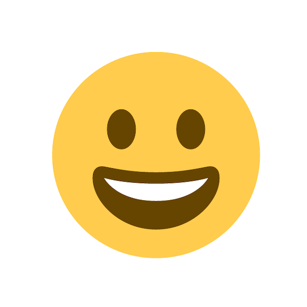

# 3.6. Send data back from Screen 2 to Screen 1, Part 4: UIImageView

## Importing images into the project

Now, let's start working with ImageViews. We need three images for moods: happy, meh, and sad. We will be using the following images in three different sizes: 1x, 2x, and 3x.

 .png>) 

Download the images from here:



If you extract the files, you will see something like the following:

<figure><figcaption></figcaption></figure>

See each image has three versions: 1x, 2x, and 3x.

* 1x images have a resolution of 200x200
* 2x images have a resolution of 400x400
* 3x images have a resolution of 600x600

These are called image scaling. To understand the concept, read the following article: [https://www.appypie.com/image-scaling-ios-how-to](https://www.appypie.com/image-scaling-ios-how-to).

Long story short, in the early iOS devices before iPhone 8, the resolutions were very low, less than 640p. There you need to use smaller images (like 200x200). Comparatively, phones like iPhone 11 or later have more than 1024p, so modern screens can accommodate bigger images (like 600x600). iOS has a great feature to scale the images automatically if you provide images with all three scales. It will automatically use the appropriate image based on the device where you run the app.

**Pro tip:** now, you usually do not have to worry about 1x images anymore; those low-resolution devices are non-existent now.

Now, let's add the images to our project. Go to the project navigator on the left pane. Click on **Assets**. Right-click somewhere below the AppIcon, and select **New Folder.** Create a folder named "mood images."

_<mark style="color:blue;">(you can name it as you want; you do not need to create the folder; I am creating the folder to help myself organize the assets).</mark>_

Now, right-click on the "mood images" folder and select **Import.** Then select the images and **Open.**

<figure><figcaption></figcaption></figure>

Looking at the Assets now, you'll see three image assets listed instead of nine. The project automatically indexed nine of them into three assets, each having 3 scales (1x, 2x, and 3x). 

## Setting the image into the ImageView through delegate

In ViewController, add the following line of code into `delegateButtonSendMood()` method:

```swift
imageMood.image = UIImage(named: mood.lowercased())
```

Here, we are creating an `UIImage` object from the project assets. We are looking for an image asset named as the mood we receive from ShowViewController through the delegate method. Now, the moods are "Happy," "Meh," and "Sad." But the image asset names are "happy," "meh," and "sad." So we convert the String to all lowercase by calling `lowercased()` method.

Let's run the app again.

<figure><figcaption></figcaption></figure>

Nice! We have learned a lot of things together from building this app:

* Designing an app without using the storyboard
* Working with multiple ViewControllers
* Navigation Controller and Navigation Stack
* Data exchange between two view controllers
* Basics of ImageViews

Thanks for bearing with me! :smile:

### A few notes:

* These are just the basics of these topics; we just scratched the surface, and many more things to explore, eventually.
* UIImageView and layout constraints do not go hand in hand. It's always better to use a UIImageView wrapped by a UIView. We will discuss it further down the road.

_<mark style="color:purple;">Now, before you go, set the title of the app by writing</mark>_ _<mark style="color:purple;">`title = "Learning Navigation"`</mark>_ _<mark style="color:purple;">in</mark>_ _<mark style="color:purple;">`viewDidLoad()`</mark>_ _<mark style="color:purple;">method at ViewController. And run the app to see the changes!</mark>_
