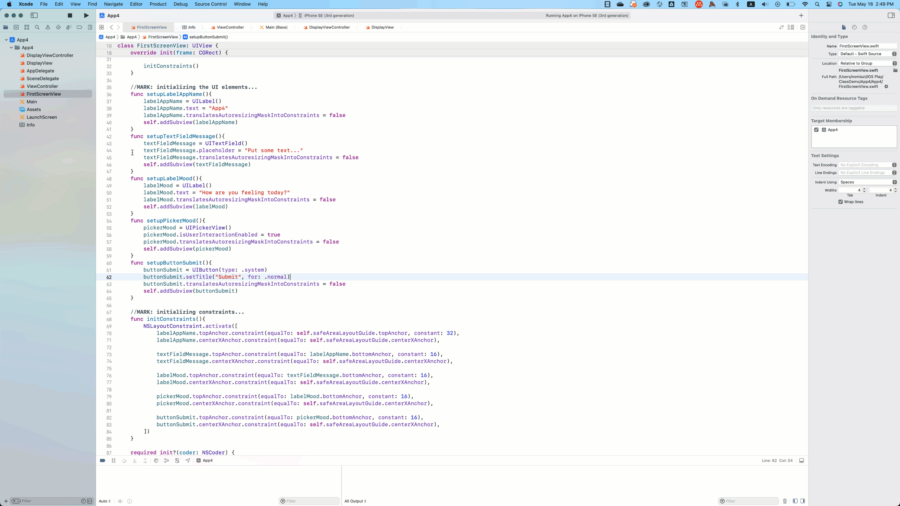

# 4.5. Wrapping up: structuring the files

Now, your project structure should look like the following:

Although we have separated the Views from the Controllers, we still may find this structure cluttered. So, we want to put the files in separate groups for better readability.&#x20;

* Select the files related to the first screen (FirstScreenView and ViewController). To select both files together, press **Command + click on the intended files.**&#x20;
* **Right-click** on the selected files and select **New Group From Selection**. Name the group as 'First Screen'
* Create the group of files (DisplayView and DisplayViewController) for the second screen similarly.

<figure><figcaption></figcaption></figure>

**Now, the structure looks a lot better!!!** :tada:
