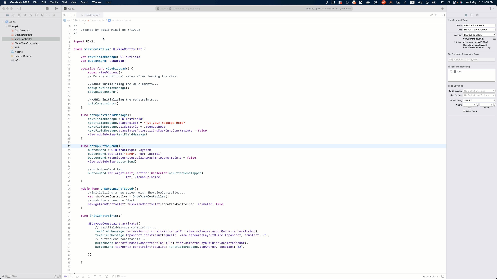

# 5.4. First screen, part 3: Setting up the View Controller and populating TableView

Now we must patch the views with our controller (ViewController.swift). Before we do, let's create a data model for the data we will display in the TableView `tableViewExpense`. We have three data points for displaying a row in the table view: expense title, amount, and type.

### Creating a data model for expenses

So, let's create a new swift file called "Expense."

* **File -> New -> File...**
* Select **iOS**
* **Select Swift file (not Cocoa Touch Class).**
* **Next**
* Name it as **"Expense."**
* Click **Create.**

<figure><figcaption></figcaption></figure>

Let's add the following code to Expense.swift file:

```swift
//
//  Expense.swift
//  App5
//
//  Created by Sakib Miazi on 5/18/23.
//

import Foundation

struct Expense{
    var title: String?
    var amount: Double?
    var type: String?
    
    init(title: String? = nil, amount: Double? = nil, type: String? = nil) {
        self.title = title
        self.amount = amount
        self.type = type
    }
    
}
```

We created a struct `Expense` with three properties: `title`, `amount`, and `type`. We also define the `init()` method to initialize the properties.

## Setting up the Controller

Let's add some dummy data to test out TableView. Add the following code in your ViewController.swift:

```swift
//
//  ViewController.swift
//  App5
//
//  Created by Sakib Miazi on 5/18/23.
//

import UIKit

class ViewController: UIViewController {
    
    //codes omitted...
    
    //MARK: expenses array to populate TableView...
    var expenses = [Expense]()
    
    //MARK: predefined types of expenses...
    let types = ["Groceries", "Rent", "Subscriptions", "Gadgets and Electronics"]
    
    //codes omitted...
    
    override func viewDidLoad() {
        super.viewDidLoad()
        //codes omitted...
                
        //MARK: adding dummy data for testing table view...
        expenses.append(Expense(title: "Pixel 7 pro", amount: 750.0, type: types[3]))
        expenses.append(Expense(title: "iPhone SE", amount: 349.0, type: types[3]))
        expenses.append(Expense(title: "Target", amount: 150.0, type: types[0]))
        expenses.append(Expense(title: "Netflix", amount: 19.0, type: types[2]))
                
        //codes omitted...
    }
    
    //codes omitted...
}
```

Here we create an array of `Expense` types (struct we created) to hold data to display in the table view. Then we predefine four types of expenses ("Groceries", "Rent", "Subscriptions", "Gadgets and Electronics") in the `types` array. Then we add four dummy expenses to test the table view.

### Patching TableView delegate and data source with the controller

Remember `extension` keyword? Now, we will adopt `UITableViewDelegate`, and `UITableViewDataSource` protocols in ViewController using `extension` keyword.

```swift
//
//  ViewController.swift
//  App5
//
//  Created by Sakib Miazi on 5/18/23.
//

import UIKit

class ViewController: UIViewController {
    //codes omitted...
    
    //MARK: expenses array to populate TableView...
    var expenses = [Expense]()
    
    //MARK: predefined types of expenses...
    let types = ["Groceries", "Rent", "Subscriptions", "Gadgets and Electronics"]
    
    //codes omitted...

    override func viewDidLoad() {
        //codes omitted...
        
        //MARK: adding dummy data for testing table view...
        expenses.append(Expense(title: "Pixel 7 pro", amount: 750.0, type: types[3]))
        expenses.append(Expense(title: "iPhone SE", amount: 349.0, type: types[3]))
        expenses.append(Expense(title: "Target", amount: 150.0, type: types[0]))
        expenses.append(Expense(title: "Netflix", amount: 19.0, type: types[2]))
                
        //codes omitted...
    }
    //codes omitted...

}

extension ViewController: UITableViewDelegate, UITableViewDataSource{
    func tableView(_ tableView: UITableView, numberOfRowsInSection section: Int) -> Int {
        return expenses.count
    }
    
    func tableView(_ tableView: UITableView, cellForRowAt indexPath: IndexPath) -> UITableViewCell {
        let cell = tableView.dequeueReusableCell(withIdentifier: "expenses", for: indexPath) as! TableViewExpenseCell
        cell.labelTitle.text = expenses[indexPath.row].title
        if let uwAmount = expenses[indexPath.row].amount{
            cell.labelAmount.text = "Cost: $\(uwAmount)"
        }
        if let uwType = expenses[indexPath.row].type{
            cell.labelType.text = "Type: \(uwType)"
        }
        return cell
    }
    
    
}


```

Let's try to understand the table view methods. Once you adopt the protocols, Xcode asks you to implement the required methods with `numberOfRowsInSection` and `cellForRowAt`.

* `numberOfRowsInSection`: First, think about the number of sections/groups we are working with in this table view. We are building only one section, just the expenses list with the same kind of cells. We just fetch the data from `expenses` array and display them. So, the number of rows would be equal to the number of items in `expenses` array. That's why we return `expenses.count`.
* `cellForRowAt`: This method returns the Cell for displaying a particular expense in the current row. Now, we need to think about how to display the data from the data source (`expenses` array) to the Cell. We display the data in the Cell we designed before (`TableViewExpenseCell`). Do you remember the identifier we set for the cell? It was "expenses."\
  \
  So in the first line, we write: `let cell = tableView.dequeueReusableCell(withIdentifier: "expenses", for: indexPath) as! TableViewExpenseCell`. Here we basically fetch an empty cell (of identifier "expenses") from the current table view and reuse it.\
  \
  _**What is a reusable cell?**_\
  _If you open up the settings app on your iPhone, you will see a long table view with many rows. Do you see all the rows at once? Or a few of the rows on the screen at once? The screen can accommodate only a limited number of them. So a table view doesn't load the whole data table at once in the memory; rather, it just loads a few of the cells it can accommodate within the screen. So, when we scroll down, it removes the cells it cannot show anymore on the screen. Those cells are still loaded in the memory but unused. So iOS recycles them. When we call dequeueReusableCell(), it checks if it already has a reusable empty cell with the identifier provided. If yes, it will reuse that; else, it will create a new cell of that identifier. For more:_ [_https://medium.com/doyeona/things-that-you-must-know-about-uitableview-in-swift-fa2f6330a337_](https://medium.com/doyeona/things-that-you-must-know-about-uitableview-in-swift-fa2f6330a337)\
  \
  Then we set the variables of that particular cell with the data we have. `indexPath.row` corresponds to the element in the data source (expenses) for that row. Then we return the cell.

Now, we need to add the following couple of lines in the `viewDidLoad()` method:

```swift
override func viewDidLoad() {
        super.viewDidLoad()
        // Do any additional setup after loading the view.
        title = "Expense App"
        
        //code omitted...
        
        //MARK: patching the table view delegate and datasource to controller...
        firstScreen.tableViewExpense.delegate = self
        firstScreen.tableViewExpense.dataSource = self
        
        //codes omitted...
    }
```

We are patching the table view's delegate and data source to the controller. By saying that, we are asking the table view to use data from this controller and assigning the controller to manage the table view.

Now, let's run it.

<figure><figcaption></figcaption></figure>

Our Table View is up and running now, displaying our dummy data!

### File structures

Since we are almost done with our first screen, let's create groups of files and put them in separate folders to structure them better.

<figure><figcaption></figcaption></figure>

The file structure looks like this:

.png>)
