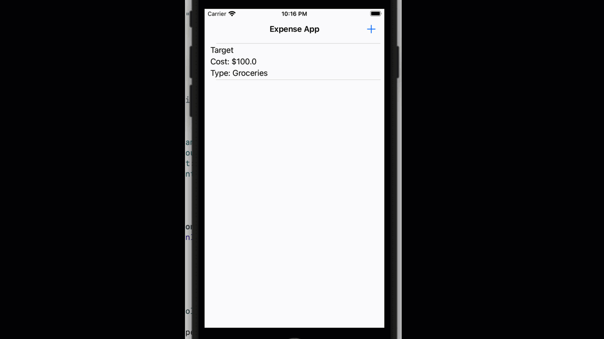

# 5.7. Second screen, part 3: Send new expense back to ViewController and update the TableView

Let's open AddExpenseViewController.swift file. Now, we will add an action for tapping on`addExpenseScreen.buttonAdd`. Once this button is tapped, we need to create an Expense object from the data the user put in and delegate the next tasks to ViewController.

So, let's add the action target for `addExpenseScreen.buttonAdd` by writing the following code in `viewDidLoad()`:

```swift
//
//  AddExpenseViewController.swift
//  App5
//
//  Created by Sakib Miazi on 5/18/23.
//

import UIKit

class AddExpenseViewController: UIViewController {
    
    //codes omitted...
    override func viewDidLoad() {
        
        //codes omitted...
        
        //MARK: adding the action for tapping on buttonAdd...
        addExpenseScreen.buttonAdd.addTarget(self, action: #selector(onAddButtonTapped), for: .touchUpInside)
    }
    
    //MARK: action for tapping buttonAdd..
    @objc func onAddButtonTapped(){
        var title:String?
        if let titleText = addExpenseScreen.textFieldTitle.text{
            if !titleText.isEmpty{
                title = titleText
            }else{
                //do your thing to alert user...
                return
            }
        }
        
        var amount = 0.0
        if let amountText = addExpenseScreen.textFieldAmount.text{
            if !amountText.isEmpty{
                if let optionalAmount = Double(amountText){
                    amount = optionalAmount
                }else{
                    //alert the user that it's not a valid input...
                    return
                }
            
                
            }else{
                //do your thing to alert the user...
                return
            }
            
        }
        
        let newExpense = Expense(title: title, amount: amount, type: selectedType)
        delegate.delegateOnAddExpense(expense: newExpense)
        navigationController?.popViewController(animated: true)
    }

}
//codes omitted...
```

Here we are fetching the inputs from the user. I am not writing the AlertController codes here again. If the user puts an empty string, you should alert the user.

### (Handling Double inputs)

Here, we are first reading the TextField text. Then, we unwrap the text and convert it to Double. The issue is the converted value is also Optional. So, we attempt to unwrap it; if we can unwrap it with `if-let`, then we set the unwrapped value to `amount`. Else, we alert the user that it is not a valid input.

Now, we will create an object of `Expense` with the fetched data and delegate the next tasks to ViewController by calling `delegateOnAddExpense(expense: newExpense)`.

### Delegating the task to ViewController

**The problem is, ViewController doesn't have `delegateOnAddExpense()` method yet.** So let's open the ViewController.swift file and add the method there:

```swift
//
//  ViewController.swift
//  App5
//
//  Created by Sakib Miazi on 5/18/23.
//

import UIKit

class ViewController: UIViewController {
    //codes omitted...
    
    //MARK: got the new expense back and delegated to ViewController...
    func delegateOnAddExpense(expense: Expense){
        expenses.append(expense)
        firstScreen.tableViewExpense.reloadData()
    }


}
//codes omitted...
```

Here, we receive an object of Expense, `expense` through the delegated method and append the new expense to the array. Then we reload the data for the TableView by calling: `firstScreen.tableViewExpense.reloadData()`.

Let's run the app.

<figure><figcaption></figcaption></figure>

One last thing to discuss before we finish this module. We can also deal with when a user clicks on a cell in the TableView.
