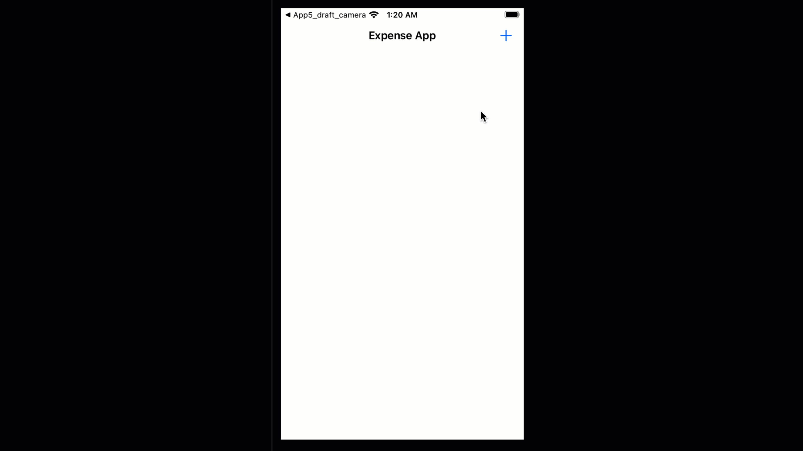
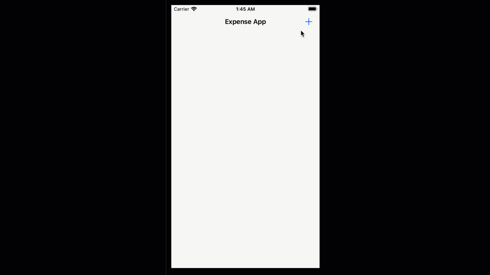

# 6.3. AddExpenseViewController: UIMenu for buttonSelectType

Now, it's time to remove the PickerView codes. After we remove the PickerView, the code looks like this:

```swift
//
//  AddExpenseViewController.swift
//  App6
//
//  Created by Sakib Miazi on 5/18/23.
//

import UIKit

class AddExpenseViewController: UIViewController {
    
    //MARK: delegate to ViewController when getting back...
    var delegate:ViewController!
    
    //MARK: by default Groceries is selected...
    var selectedType = "Groceries"

    //MARK: initializing the ADDExpenseView...
    let addExpenseScreen = AddExpenseView()
    
    //MARK: set the current view to addExpenseScreen...
    override func loadView() {
        view = addExpenseScreen
    }
    
    override func viewDidLoad() {
        super.viewDidLoad()
        
        //MARK: adding the action for tapping on buttonAdd...
        addExpenseScreen.buttonAdd.addTarget(self, action: #selector(onAddButtonTapped), for: .touchUpInside)
    }
    
    //MARK: action for tapping buttonAdd..
    @objc func onAddButtonTapped(){
        var title:String?
        if let titleText = addExpenseScreen.textFieldTitle.text{
            if !titleText.isEmpty{
                title = titleText
            }else{
                //do your thing to alert user...
            }
        }
        
        var amount = 0.0
        if let amountText = addExpenseScreen.textFieldAmount.text{
            if !amountText.isEmpty{
                if let uwAmount = Double(amountText){
                    amount = uwAmount
                }else{
                    //alert the user that it's not a valid input...
                }
            
                
            }else{
                //do your thing to alert the user...
            }
            
        }
        
        let newExpense = Expense(title: title, amount: amount, type: selectedType)
        delegate.delegateOnAddExpense(expense: newExpense)
        navigationController?.popViewController(animated: true)
    }

}
```

Now if you run the app, it will look like the following:

<figure><figcaption></figcaption></figure>

So now, let's add the actions for the newly added buttons, `buttonSelectType` and `buttonTakePhoto`.

### UIMenu for buttonSelectType

When the user taps on `buttonSelectType`, it should display a pop-up menu with four options. Let's add the code for it. In AddExpenseViewController.swift add:

```swift
//
//  AddExpenseViewController.swift
//  App6
//

class AddExpenseViewController: UIViewController {
    //codes omitted...
    
    override func viewDidLoad() {
        super.viewDidLoad()
        
        //MARK: adding menu to buttonSelectType...
        addExpenseScreen.buttonSelectType.menu = getMenuTypes()
        
        //codes omitted...
    }
    
    //MARK: menu for buttonSelectType setup...
    func getMenuTypes() -> UIMenu{
        var menuItems = [UIAction]()
        
        for type in Utilities.types{
            let menuItem = UIAction(title: type,handler: {(_) in
                                self.selectedType = type
                                self.addExpenseScreen.buttonSelectType.setTitle(self.selectedType, for: .normal)
                            })
            menuItems.append(menuItem)
        }
        
        return UIMenu(title: "Select type", children: menuItems)
    }
    //codes omitted...
}

```

We write `addExpenseScreen.buttonSelectType.menu` to set the menu. We write a mehod `getMenuTypes() -> UIMenu` to generate the menu. Let's look into the method.

We create an array of UIMenu items (four in our case). Each UIMenu item is an UIAction with the title of the menu item and the [closure](https://github.com/sakibnm/iOS/blob/main/7.-closures) for defining the tasks we should do if we select that item from the menu. For example, in each iteration of the loop:

```swift
for type in Utilities.types{
    let menuItem = UIAction(title: type,handler: {(_) in
                self.selectedType = type
                self.addExpenseScreen.buttonSelectType.setTitle(self.selectedType, for: .normal)
            })
    menuItems.append(menuItem)
}
```

Here, we are creating a menu item using the `Utilities.types` array. The `handler` closure defines the on-select actions for that item. We are saying that if the user selects this particular menu item, set the value of `selectedType` to the corresponding type of expense. And set the title of the button to the selected item.

So let's run the app now.

<figure><figcaption></figcaption></figure>

See, if we long tap on `buttonSelectType` then a menu pops up, and we can select a type of expense. But we want this menu to pop up when we do regular tap. By default, the menu pop-up is not set as the primary action of a Button. We have to set it as an attribute of the Button when we initialize it. So let's go to AddExpenseView.swift and edit the `setupbuttonSelectType()` method:

```swift
func setupbuttonSelectType(){
    buttonSelectType = UIButton(type: .system)
    buttonSelectType.setTitle("Select the type of expense:", for: .normal)
    //MARK: the on-tap primary action will pop up the menu...
    buttonSelectType.showsMenuAsPrimaryAction = true
    buttonSelectType.translatesAutoresizingMaskIntoConstraints = false
    self.addSubview(buttonSelectType)
}
```

Now let's run the app again:

<figure><figcaption></figcaption></figure>

Now, our menu is working as intended.
