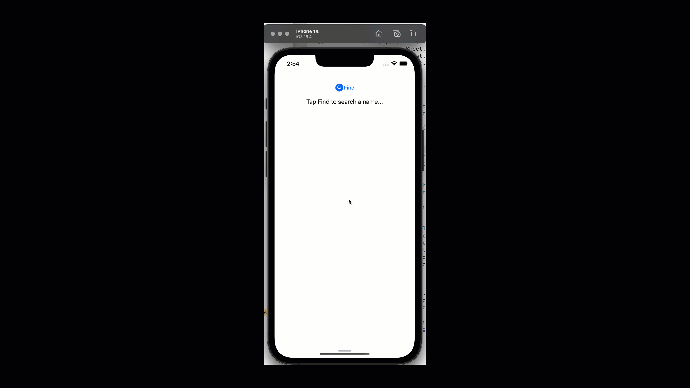

# 7.3. Main Screen

The main screen is very simple to design; we have:

* A label to display the selected name from the bottom search sheet.
* A Find button to pop the bottom search sheet.

## Main Screen View

Let's create a file named MainScreenView.swift:


Let's put the following code there:

```swift
//
//  MainScreenView.swift
//  BottomSheetViewDemo
//
//  Created by Sakib Miazi on 6/13/23.
//

import UIKit

class MainScreenView: UIView {

    var labelName: UILabel!
    var buttonSelect: UIButton!
    
    override init(frame: CGRect) {
        super.init(frame: frame)
        
        self.backgroundColor = .white
        
        //MARK: initializing labelName...
        labelName = UILabel()
        labelName.text = "Tap Find to search a name..."
        labelName.translatesAutoresizingMaskIntoConstraints = false
        self.addSubview(labelName)
        
        //MARK: initializing buttonSelect...
        buttonSelect = UIButton(type: .system)
        buttonSelect.setTitle("Find", for: .normal)
        buttonSelect.setImage(UIImage(systemName: "magnifyingglass.circle.fill"), for: .normal)
        buttonSelect.translatesAutoresizingMaskIntoConstraints = false
        self.addSubview(buttonSelect)
        
        //MARK: initializing constraints...
        NSLayoutConstraint.activate([
            buttonSelect.topAnchor.constraint(equalTo: self.safeAreaLayoutGuide.topAnchor, constant: 32),
            buttonSelect.centerXAnchor.constraint(equalTo: self.safeAreaLayoutGuide.centerXAnchor),
            
            labelName.topAnchor.constraint(equalTo: buttonSelect.bottomAnchor, constant: 16),
            labelName.centerXAnchor.constraint(equalTo: self.safeAreaLayoutGuide.centerXAnchor),
            
        ])
    }
    
    required init?(coder: NSCoder) {
        fatalError("init(coder:) has not been implemented")
    }
}

```

## Main Screen Controller

Now it's time to patch the actions to pop the bottom search sheet from the view controller. Let's put the following code in ViewController.swift:


```swift
//
//  ViewController.swift
//  BottomSheetViewDemo
//
//  Created by Sakib Miazi on 6/13/23.
//

import UIKit

class ViewController: UIViewController {
    let mainScreen = MainScreenView()
    
    let searchSheetController = SearchBottomSheetController()
    var searchSheetNavController: UINavigationController!
    
    override func loadView() {
        view = mainScreen
    }

    override func viewDidLoad() {
        super.viewDidLoad()
        title = "Bottom Sheet Demo"        
        mainScreen.buttonSelect.addTarget(self, action: #selector(onFindButtonTapped), for: .touchUpInside)
    }
    
    func setupSearchBottomSheet(){
        //MARK: setting up bottom search sheet...
        searchSheetNavController = UINavigationController(rootViewController: searchSheetController)
        
        // MARK: setting up modal style...
        searchSheetNavController.modalPresentationStyle = .pageSheet
        
        if let bottomSearchSheet = searchSheetNavController.sheetPresentationController{
            bottomSearchSheet.detents = [.medium(), .large()]
            bottomSearchSheet.prefersGrabberVisible = true
        }
    }    
    @objc func onFindButtonTapped(){
        setupSearchBottomSheet()
        present(searchSheetNavController, animated: true)
    }
}
```


In the above code:

* On line 13, we instantiate the bottom search sheet controller.
* On line 14, we declare the navigation controller to embed the bottom sheet controller into it.
* On lines 16 through 18, we patch the main screen's view with the controller.
* On line 23, we add a target action for the FInd button.
  * On lines 38 through 41, we define the action to handle the user tapping on the Find button.
  * We first call the `setupSearchBottomSheet()` method to instantiate the search bottom bar. ([More on this a little later](7.3.-main-screen.md#creating-the-bottom-search-sheet)).
  * Then we present the navigation controller `searchSheetNavController`.&#x20;

### Creating the Bottom Search Sheet

* On lines 26 through 37, we define and build the bottom search sheet.
* On line 28, we define the navigation controller `searchSheetNavController` embedding the   `searchSheetController` in it.
* On line 31, we define the presentation style of the bottom search sheet. There are other styles available. You can look here for the details: [https://developer.apple.com/documentation/uikit/uimodalpresentationstyle](https://developer.apple.com/documentation/uikit/uimodalpresentationstyle)
* **The next part is crucial for setting the behavior of the bottom search sheet.**&#x20;
  * On line 34, we define the detents of the bottom search sheet. _(detent means - a catch in a machine which prevents motion until released.)_&#x20;
  * **Detent** here means exactly the same thing. It means the detents can put a brake on its movement when the bottom sheet pops up. Swift currently allows two detents: medium() and large().
    * **medium()** detent brakes the pop up sheet in the middle of the screen.
    * **large()** detent does not brake the sheet until it reaches the top of the screens.&#x20;
    * We add both of the detents here so that it stops in the middle; then, if we want, we can fill up the screen with it.

<figure><figcaption><p><strong>Detents</strong></p></figcaption></figure>

* On line 35, we display the grabber.


Now, our app is almost ready. We just need to return the name to main screen when the user taps a name from the bottom search sheet's table view.
