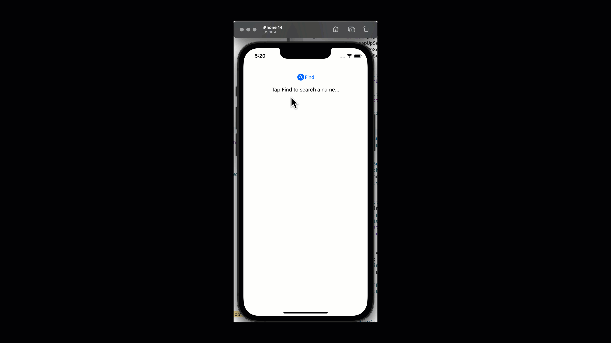

# 7.4. Sending data back to Main Screen

We will use Notification Center to do that.&#x20;

* **We will observe any notifications coming from the bottom search sheet if the user selects any of the names in the main screen's ViewController.**
* **We will post notifications from SearchBottomSheetController when the user selects a table view row.**&#x20;

Let's open ViewController.swift file, and update the file with the following code:


```swift
//
//  ViewController.swift
//  BottomSheetViewDemo
//
//  Created by Sakib Miazi on 6/13/23.
//

import UIKit

class ViewController: UIViewController {
   //codes omitted...
    
    let notificationCenter = NotificationCenter.default
    
    override func loadView() {
        view = mainScreen
    }

    override func viewDidLoad() {
        //codes omitted
        
        observeNameSelected() 
    }
    
    //codes omitted...

    //MARK: Observe if the user selected a name from bottom sheet...
    func observeNameSelected(){
        notificationCenter.addObserver(
            self,
            selector: #selector(onNameSelected(notification:)),
            name: .nameSelected, object: nil)
    }
    @objc func onNameSelected(notification: Notification){
        if let selectedName = notification.object{
            mainScreen.labelName.text = selectedName as! String
        }
    }
  
}
```


In the above code:

* On line 13, we are initializing the Notification Center.
* On line 22, we set the observer for the notification.
* From lines 27 through 38 we are observing for a notification `.nameSelected`. We create a separate file to store the names of the Notifications just like [7.-notification-center](../../7.-notification-center/ "mention").&#x20;
* On line 34, the `onNameSelected()` method gets triggered when the notification is received.&#x20;
  * On line 36, we set the name with the data we receive through the notification.

## Table View in Bottom Search Sheet Controller: overriding didSelectRowAt

Let's open SearchBottomSheetController.swift file and add the following method inside the extension where we are adopting the table view protocols:


```swift
//MARK: adopting Table View protocols...
extension SearchBottomSheetController: UITableViewDelegate, UITableViewDataSource{
    //codes omitted...
    
    func tableView(_ tableView: UITableView, didSelectRowAt indexPath: IndexPath) {
        //MARK: name selected....
        notificationCenter.post(name: .nameSelected, object: namesForTableView[indexPath.row])
        
        //MARK: dismiss the bottom search sheet...
        self.dismiss(animated: true)
    }
}
```


In the above code:

* We are waiting for the user to tap on a table view cell.&#x20;
* On line 7, we post the selected name to the notification center.
* On line 10, we remove the bottom search sheet by calling dismiss.

Let's run the app.

<figure><figcaption></figcaption></figure>

**Nice! We built our first Bottom Sheet View!**
