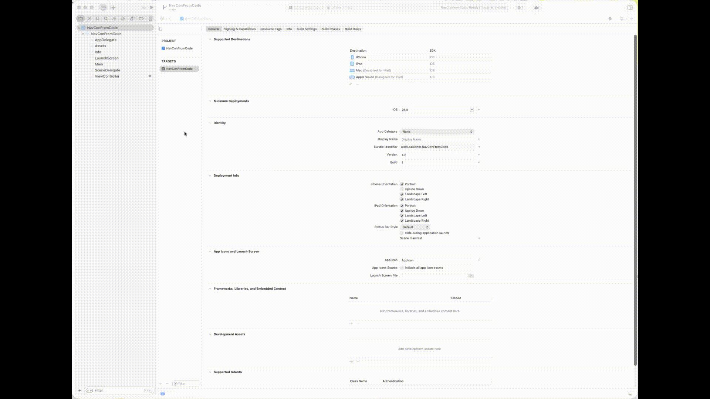

# Embed Navigation Controller from code (Not Storyboard)

So far you have noticed, we embed the Navigation Controller using the Storyboard (refer to [3.1.-navigation-controller.md](../3.-our-first-multi-screen-app/3.1.-navigation-controller.md "mention") ). What about we want to remove that process and want to add Navigation Controller by writing code? That way it'll be easy to change the name of the default "ViewController.swift" file to a more appropriate name.&#x20;

To start, we will create a new iOS project in Xcode named, "NavConFromCode."&#x20;

<figure><figcaption></figcaption></figure>

We already know that it comes with a default view controller: **ViewController.swift**

So let's first change the name of it to a different name: **FirstScreenViewController.swift**

<figure><figcaption></figcaption></figure>

<mark style="color:$danger;background-color:red;">**Please note, we are also changing the name of the class.**</mark>&#x20;

Then just open SceneDelegate.swift file, and update the \
`func scene(_ scene: UIScene, willConnectTo session: UISceneSession, options connectionOptions: UIScene.ConnectionOptions)` function.


```swift
func scene(_ scene: UIScene, willConnectTo session: UISceneSession, options connectionOptions: UIScene.ConnectionOptions) {
            
    guard let windowScene = (scene as? UIWindowScene) else { return }
    
    // Create your root view controller
    let rootViewController = FirstScreenViewController()
    
    // Embed it in a navigation controller
    let navigationController = UINavigationController(
                    rootViewController: rootViewController
            )
    
    // Create and configure the window
    window = UIWindow(windowScene: windowScene)
    window?.rootViewController = navigationController
    window?.makeKeyAndVisible()
}
```


On line 3, we define windowScene as a variable since we want to manipulate the window on the app.

On line 6, we define our root view controller for the navigation stack. (Our first/main screen).

On line 9, we define the navigation controller to be added. And set the root view controller to the main screen.

Then on lines 14 through 16, we setup the window of the app.&#x20;

Now, if we run the app, it should run as the FirstScreenViewController being the main view controller.

### Resource Files



